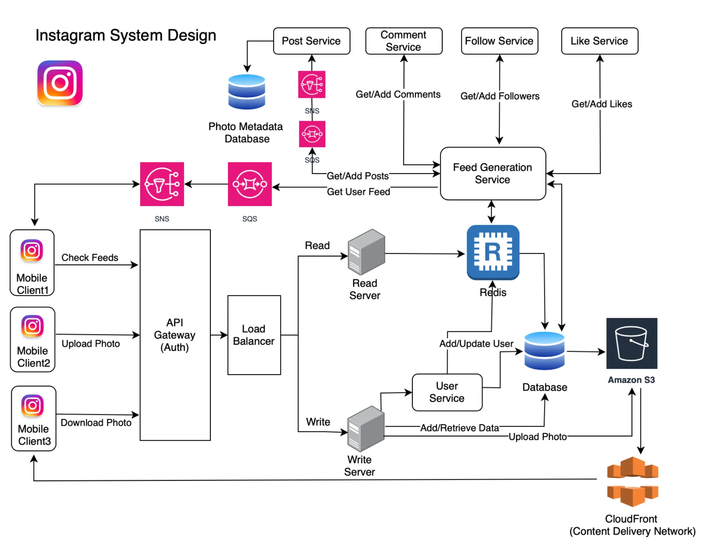

# Instagram System Design

This document outlines the Proof of Concept (PoC) for an Instagram-like system design. This PoC aims to demonstrate the basic functionalities and architecture of a social media platform similar to Instagram, focusing on key features such as user management, posting, following & generating feeds.


## System Design

```
Architecture + Data + Application
```

- Architecture means how are you going to put the different functioning blocks of a system together and make them seamlessly work with each other after taking into account all the nodal points where a sub-system can fail/stop working.
- Data means what is the input, what are the data processing blocks, how to store petabytes of data and most importantly how to process it and give the desired/required output.
- Applications means once the data is processed and output is ready how are the different applications attached to that large back end system will utilize that data.

## What is Instagram?

Instagram is a social networking platform where users can —

1. Upload and share Photos and videos
2. Follow other users
3. Chat with other people
4. Can control the visibility of their content by making it public ( accessible to everyone) or private ( accessible to the people who follow)
5. Create stories
6. Tag another user/location in the post ( photo/video)
7. Watch the feed of other users they follow.

## Capacity Estimation

It's important to consider that read requests will be significantly more frequent than write requests, with a ratio of approximately `100 to 1`.

- Let's assume there are 500 million users registered on the platform, with 1 million active users per day.
- If 5 million images are posted daily, this translates to an average of 57 photos being uploaded per second (5M / (246060)).
- If the average photo size is 150 KB, then the daily storage usage is 716 GB (5M * 150KB).
- If we assume the service will be active for ten years, the total space required will be approximately 2.6 PB (716GB * 365 * 10)


## Components

| Component             | Description                                                                |
| ----------------- | ------------------------------------------------------------------ |
| User Account | Users would need to be able to create accounts and log in to the application. This would involve designing a registration and login system, as well as a way to securely store user information such as passwords. |
| Profile | Users would need to be able to create and edit their own profiles, which would include things like a profile picture, bio, and contact information. |
| Feed | The main feature of Instagram is the feed, where users can view posts from the people they follow. The feed would need to be designed to show posts in reverse chronological order and include features like pagination to handle a large number of posts. |
| Posting| Users would need to be able to create and post new content, including photos and videos, as well as add captions, tags, and locations. | 
| Search | A search feature would need to be implemented so that users can find other users and posts by searching for keywords or hashtags. |
| Notifications| Users would need to be notified of new posts from the people they follow, comments on their posts, and other interactions on the platform. |
| Direct Messaging | Users would need to be able to send direct messages to other users and view their message history. |
| Scalability | Instagram needs to be able to handle a large number of users and high traffic loads. This would involve designing the application to be scalable, including using technologies such as load balancers and distributed systems. |
| Security | Instagram would need to be designed with security in mind, to protect user data and prevent unauthorized access. |
| Mobile & Web| Instagram should be designed for web and mobile platforms so that it can be used on any device. |

## High Level Design

- The system is read heavy ( people see photos more than posting)
- There will be more reads than writes so we need to design read heavy system — More Slaves replicas ( where we can perform read operations fast)
- We will be scaling horizontally (scale — out).
- Services should be highly available.
- Latency should be ~350ms for the feed generation.
- Consistency vs Availability vs Reliability: Availability and Reliability are more important than consistency in this case.


## Design Consideration

#### Data store for storing uploaded image 

Our System is read heavy, so we need a data store that can quickly fetch the uploaded image and render on user application. Couple of things that needs to be kept in mind is 

1. The data store should be reliable as we do not want user’s uploaded image to get lost. 
2. User can upload as many images as they so the data store should be scalable to handle billions of images. 
3. Latency should be low when retrieving the photos. We can consider an object storage to store the uploaded images by user something like AWS S3. There are other types of storage as well like file storage and block storage but considering the above factors object storage will be a right fit for our design as it gives low read latency and efficient management of huge number of records.

#### Data store for storing user data and its uploads

Now we have a data store to store the uploaded image by users. We need a database to store the metadata of user uploads and user data. Things to keep in mind while deciding data store

1. The database should be highly available. 
2. It should have low read latency as our system is ready heavy. 
3. It should be scalable enough to handle billions of record.
4. It should be reliable and should support sharding and replication. 



## Main Components

- **Client —** These will be the mobile/desktop application that will connect to backend servers via REST API’s defined above.
- **Api-Gateway (Auth) —** Verifies the user authority and redirects the user to specific service.
- **Load balancer —** We will use load balancer’s to distribute the traffic between different servers. This will make our System more available and in case a server goes down behind a load balancer, load balancer can distribute the traffic on different servers.
- **Image Service —** Image service is responsible for providing API’s to upload image and get image meta data. The meta data API will return the image path in s3 which will be used by clients to load image on their application.
- **Read Server —** handles read requests like user profile and posts
- **Write Server —** handles write requests like upload photo and video and add comments
- **S3 —** We are using object storage to store the uploaded images by users. AWS S3 is scalable and cheap object storage that we can use here. We can integrate it with AWS CloudFront so that the images can be rendered on user application much faster.
- **CloudFront —** Amazon CloudFront is a content delivery network (CDN) service built for high performance, security, and developer convenience. With the help of CloudFront the images will be rendered faster on user application.
- **SNS —** On every user upload we are publishing a notification with the help of AWS Simple Notification Service.
- **SQS —** We use AWS Simple Queue Service that will subscribe to upload event SNS and the feed generation service will listen to this SQS to get the latest feed.
- **Feed generation Service —** This service is responsible for user feed generation. It will listen to the user upload events via SQS and start the process for user feed generation. 
- **Redis Cache —**  Stores data temporarily to speed up retrieval and optimize performance.  For keeping the read latency low for our users, we implement a caching layer in between our feed generation service and DDB. When a request will come to fetch a user’s feed, it will first check in the redis cache, if not available then it will fetch it from DDB and return the response.
- **DataStore (SQL / NoSQL) —** Now based on the requirement we will need to use SQL database or NoSQL DB. We can use NoSQL DB  for storing metadata about uploaded images, user feeds etc. However, relational databases can be used for storing the User details.

## Database Design

- Most of our data such as users, posts, photos/videos uploaded by users, and user follows are relational. We also require high durability for our data. Queries like fetching all followers or posts for a specific user can be easily executed in a SQL database. Therefore, SQL is a good choice as our primary database technology. However, we need to consider scalability, as SQL databases do not inherently provide out-of-the-box horizontal scaling.
- To enable horizontal scalability, we can employ database sharding techniques to distribute data across multiple SQL instances. For example, we can shard based on the user_id to ensure all queries and data for a given user exist on a single shard. We can also explore NoSQL databases like Cassandra for their horizontal scaling capabilities. A hybrid SQL and NoSQL approach combining the relational model and scalability may serve Instagram’s needs best.
- In reality, Instagram uses PostgresSQL as its primary relational database. However, to scale PostgresSQL to handle Instagram’s massive data volumes, which include billions of rows across core tables, Instagram built a custom sharding solution.
- In addition to its sharded PostgresSQL architecture, Instagram leverages NoSQL databases like Cassandra, Redis for certain use cases where flexibility and performance are critical.
- For example, Cassandra is used to store time series data like metrics, aggregates, and analytics that can be appended independently. The innate scalability, flexibility, and write speed of Cassandra makes it a good fit for high velocity telemetry data.
- Redis is used extensively for caching — it stores ephemeral data like feed items, stories, and other content that needs low latency access. By keeping hot content in memory, Redis reduces load on backend stores. Its support for data structures like sorted sets and lists simplifies certain types of application logic as well.
- By combining the relational model of PostgresSQL with the speed and scaling capabilities of Cassandra and Redis, Instagram gets the best of both worlds. The hybrid data architecture allows each technology to be optimized for the use case it serves best, improving performance & scalability.


## News Feed Generation

#### Generating news feed

- Designing a customized newsfeed for each user that showcases the most recent post from each user they are following is a critical aspect of an Instagram-like service. For the sake of simplicity, let's assume that each user and their followers upload 200 unique photos per day. This means that a user's newsfeed will consist of a combination of these 200 unique photographs, followed by the reputation of previous submissions. This allows the user to see the most recent and relevant content from the users they follow.
- To generate a news feed for a user, we will first retrieve the metadata (such as likes, comments, time, location, etc.) of the most recent 200 photographs and pass it to a ranking algorithm. This algorithm will use the metadata to determine the order in which the photos should be displayed in the news feed. This allows the user to see the most relevant and engaging content at the top of their feed.
- One disadvantage of the news feed generation approach described above is that it requires simultaneously querying a large number of tables and ranking them based on predefined criteria. This can result in higher latency, meaning it takes a longer time to generate a news feed. To improve performance, we may need to optimize the queries and ranking algorithms, or consider alternative approaches such as pre-computing and caching the results.
- To address the latency issues with the news feed generation algorithm described above, we can set up a server that pre-generates a unique news feed for each user and stores it in a separate news feed table. When a user wants to access their news feed, we can simply query this table to retrieve the most recent content. This approach reduces the need to query and rank a large number of tables in real-time, improving the performance and responsiveness of the system.

#### Serving the news feed

We have now discussed how to create a news feed. The next challenge in designing the architecture of an Instagram-like service is determining how to deliver the generated news feed to users.

One approach is to use a push mechanism, where the server alerts all of a user's followers whenever they upload a new photo. This can be done using a technique called long-polling. However, this approach may be inefficient if a user follows a large number of people, as the server would need to push updates and deliver notifications frequently.

An alternative approach is to use a pull mechanism, where users refresh their news feeds (send a request to the server) to see new content. However, this can be problematic because new posts may not be visible until the user refreshes, and many refreshes may return empty results.

A hybrid approach combines the benefits of both push and pull mechanisms. For users with a large number of followers (such as celebrities), the server can use a pull-based approach. For all other users, the server can use a push-based approach. This allows for efficient delivery of updates while minimizing the burden on the server.


## Current Instagram Tech Stack (2024)

- Frontend Technologies: React, GraphQL
- Backend Technologies: Django (Python):, Golang
- Data Storage and Management: PostgreSQL, Cassandra, Redis
- Distributed Systems and Real-Time Processing: Apache Kafka, RabbitMQ
- Content Delivery and Media Storage: Amazon S3, CDN (Cloudflare and Akamai)
- Machine Learning and AI: TensorFlow and PyTorch, Faiss
- Monitoring, Analytics, and Logging: Elasticsearch, Logstash, Kibana (ELK Stack), Graphite and Grafana
- Security and Privacy: TLS/SSL, OAuth 2.0
- DevOps and Infrastructure: Docker and Kubernetes, Terraform and Ansible


## References

Here are some References

- https://roadmap.sh/system-design
- https://medium.com/@sonal.dhanetwal.rai/instagram-system-design-a7bd2aa820c
- https://nikhilgupta1.medium.com/instagram-system-design-f62772649f90 
- https://www.enjoyalgorithms.com/blog/design-instagram
- https://instagram-engineering.com/what-powers-instagram-hundreds-of-instances-dozens-of-technologies-adf2e22da2ad
- https://github.com/donnemartin/system-design-primer/blob/master/solutions/system_design/social_graph/README.md
- https://read.learnyard.com/hld-instagram-system-design/


## Authors

- [@Khushbu](https://github.com/Khushbu-2112)

