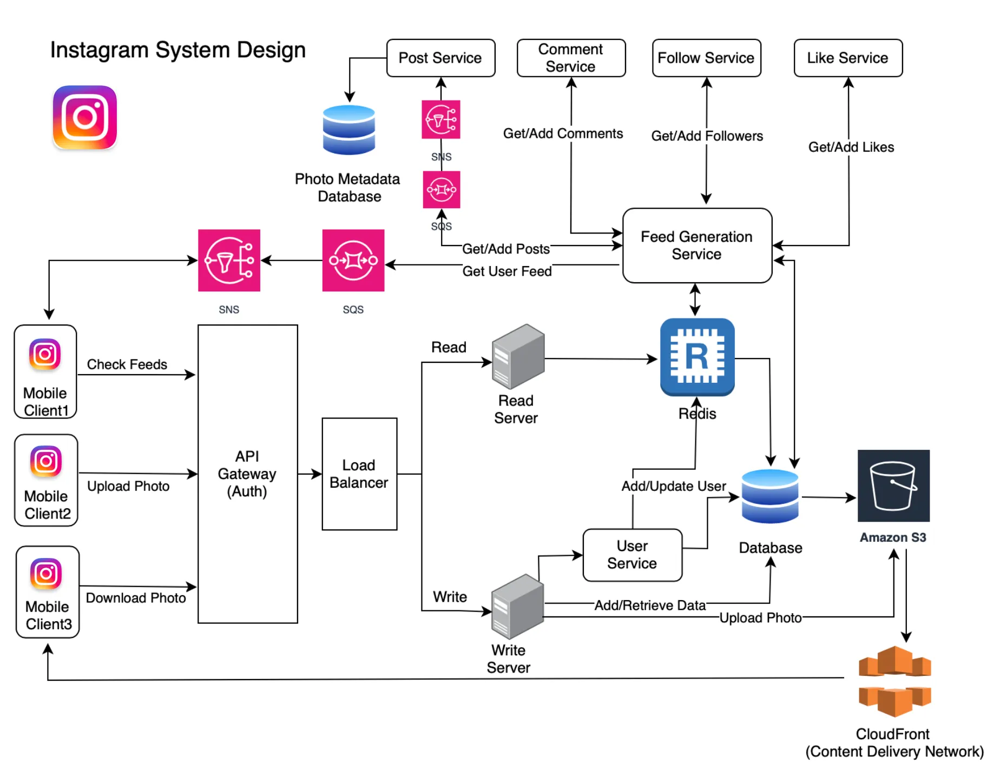
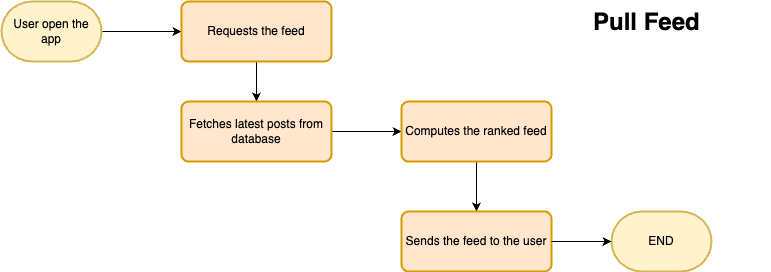
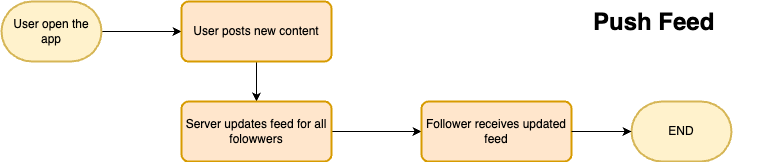

# Instagram System Design

This document outlines the Proof of Concept (PoC) for an Instagram-like system design. This PoC aims to demonstrate the basic functionalities and architecture of a social media platform similar to Instagram, focusing on key features such as user management, posting, following & generating feeds.


## System Design

[System design](https://roadmap.sh/system-design) is the process of defining the elements of a system, as well as their interactions and relationships, in order to satisfy a set of specified requirements. 
```
Architecture + Data + Application
```

- Architecture means how are you going to put the different functioning blocks of a system together and make them seamlessly work with each other after taking into account all the nodal points where a sub-system can fail/stop working.
- Data means what is the input, what are the data processing blocks, how to store petabytes of data and most importantly how to process it and give the desired/required output.
- Applications means once the data is processed and output is ready how are the different applications attached to that large back end system will utilize that data.

## What is Instagram?

Instagram is a social networking platform where users can —

1. Upload and share Photos and videos
2. Follow other users
3. Chat with other people
4. Can control the visibility of their content by making it public ( accessible to everyone) or private ( accessible to the people who follow)
5. Create stories
6. Tag another user/location in the post ( photo/video)
7. Watch the feed of other users they follow.

## Capacity Estimation

It's important to consider that read requests will be significantly more frequent than write requests, with a ratio of approximately `100 to 1`.

- Let's assume there are 500 million users registered on the platform, with 1 million active users per day.
- If 5 million images are posted daily, this translates to an average of 57 photos being uploaded per second (5M / (246060)).
- If the average photo size is 150 KB, then the daily storage usage is 716 GB (5M * 150KB).
- If we assume the service will be active for ten years, the total space required will be approximately 2.6 PB (716GB * 365 * 10)

## Components

| Component             | Description                                                                |
| ----------------- | ------------------------------------------------------------------ |
| User Account | Users would need to be able to create accounts and log in to the application. This would involve designing a registration and login system, as well as a way to securely store user information such as passwords. |
| Profile | Users would need to be able to create and edit their own profiles, which would include things like a profile picture, bio, and contact information. |
| Feed | The main feature of Instagram is the feed, where users can view posts from the people they follow. The feed would need to be designed to show posts in reverse chronological order and include features like pagination to handle a large number of posts. |
| Posting| Users would need to be able to create and post new content, including photos and videos, as well as add captions, tags, and locations. | 
| Search | A search feature would need to be implemented so that users can find other users and posts by searching for keywords or hashtags. |
| Notifications| Users would need to be notified of new posts from the people they follow, comments on their posts, and other interactions on the platform. |
| Direct Messaging | Users would need to be able to send direct messages to other users and view their message history. |
| Scalability | Instagram needs to be able to handle a large number of users and high traffic loads. This would involve designing the application to be scalable, including using technologies such as load balancers and distributed systems. |
| Security | Instagram would need to be designed with security in mind, to protect user data and prevent unauthorized access. |
| Mobile & Web| Instagram should be designed for web and mobile platforms so that it can be used on any device. |

## High Level Design

- The system is read heavy ( people see photos more than posting)
- There will be more reads than writes so we need to design read heavy system — More [Slaves replicas](https://www.geeksforgeeks.org/types-of-database-replication-system-design/) ( where we can perform read operations fast)
- We will be [scaling](https://www.geeksforgeeks.org/what-is-scalability-and-how-to-achieve-it-learn-system-design/) horizontally (scale — out).
- Services should be highly available.
- [Latency](https://www.ibm.com/topics/latency) should be ~350ms for the feed generation.
- Consistency vs Availability vs Reliability: Availability and Reliability are more important than consistency in this case.(https://robertgreiner.com/cap-theorem-revisited/)

## Design Consideration

#### Data store for storing uploaded image 

Our System is read heavy, so we need a data store that can quickly fetch the uploaded image and render on user application. Couple of things that needs to be kept in mind is 

1. The data store should be reliable as we do not want user’s uploaded image to get lost. 
2. User can upload as many images as they so the data store should be scalable to handle billions of images. 
3. Latency should be low when retrieving the photos. We can consider an [object storage](https://cloud.google.com/learn/what-is-object-storage) to store the uploaded images by user something like AWS S3. There are other types of storage as well like file storage and block storage but considering the above factors object storage will be a right fit for our design as it gives low read latency and efficient management of huge number of records.

#### Data store for storing user data and its uploads

Now we have a data store to store the uploaded image by users. We need a database to store the metadata of user uploads and user data. Things to keep in mind while deciding data store

1. The database should be highly available. 
2. It should have low read latency as our system is ready heavy. 
3. It should be scalable enough to handle billions of record.
4. It should be reliable and should support [sharding](https://www.geeksforgeeks.org/what-is-sharding/) and [replication](https://www.geeksforgeeks.org/data-replication-in-dbms/). 




## Main Components

- **Client —** These will be the mobile/desktop application that will connect to backend servers via REST API’s defined above.
- **Api-Gateway (Auth) —** Verifies the user authority and redirects the user to specific service.
- **Load balancer —** We will use load balancer’s to distribute the traffic between different servers. This will make our System more available and in case a server goes down behind a load balancer, load balancer can distribute the traffic on different servers.
- **Image Service —** Image service is responsible for providing API’s to upload image and get image meta data. The meta data API will return the image path in s3 which will be used by clients to load image on their application.
- **Read Server —** handles read requests like user profile and posts
- **Write Server —** handles write requests like upload photo and video and add comments
- **S3 —** We are using object storage to store the uploaded images by users. AWS S3 is scalable and cheap object storage that we can use here. We can integrate it with AWS CloudFront so that the images can be rendered on user application much faster.
- **CloudFront —** Amazon CloudFront is a content delivery network [(CDN)](https://www.cloudflare.com/learning/cdn/what-is-a-cdn/) service built for high performance, security, and developer convenience. With the help of CloudFront the images will be rendered faster on user application.
- **SNS —** On every user upload we are publishing a notification with the help of AWS Simple Notification Service.
- **SQS —** We use AWS Simple Queue Service that will subscribe to upload event SNS and the feed generation service will listen to this SQS to get the latest feed.
- **Feed generation Service —** This service is responsible for user feed generation. It will listen to the user upload events via SQS and start the process for user feed generation. 
- **Redis Cache —**  Stores data temporarily to speed up retrieval and optimize performance.  For keeping the read latency low for our users, we implement a [caching](https://www.geeksforgeeks.org/caching-system-design-concept-for-beginners/) layer in between our feed generation service and DDB. When a request will come to fetch a user’s feed, it will first check in the redis cache, if not available then it will fetch it from DDB and return the response.
- **DataStore (SQL / NoSQL) —** Now based on the requirement we will need to use SQL database or NoSQL DB. We can use NoSQL DB  for storing metadata about uploaded images, user feeds etc. However, relational databases can be used for storing the User details.

#### Flow of Operations

User Uploads an Image:

- The user uploads an image via the client application.
- The client sends the image to the Image Service, which uploads it to S3.
- The Image Service stores metadata in the NoSQL database and returns the S3 path to the client.
- The Image Service publishes an upload notification to SNS.

Feed Generation:

- SQS subscribes to SNS and queues the upload event.
- The Feed Generation Service listens to SQS and starts processing the event.
- It retrieves necessary data, generates the user feed, and stores it in the NoSQL database.
- The generated feed is also cached in Redis for faster retrieval.

User Requests Feed:

- The client requests the user's feed.
- The Read Server first checks Redis for the cached feed.
- If the feed is in Redis, it is returned to the client.
- If not, the Read Server fetches the feed from the NoSQL database, returns it to the client, and updates the Redis cache for future requests.

User Interacts with Content:

- Actions like adding comments or liking posts are sent to the Write Server.
- The Write Server processes these actions and updates the relevant data in the NoSQL database.

## Database Design

Choosing the right database for a system like Instagram involves considering multiple factors, including scalability, consistency, speed, and the types of data you need to store.

- Core Transactional Data: Use a relational database like PostgreSQL for user accounts, authentication, and follow relationships due to the strong [ACID](https://www.geeksforgeeks.org/acid-properties-in-dbms/) guarantees and support for complex queries.
- Content and Metadata: Use a document store like MongoDB to store posts, comments, and user profiles. The flexibility of document stores aligns well with the varying structures of this data.
- Caching: Use Redis as a caching layer to speed up access to frequently queried data, such as user sessions, feed data, and user profiles.
- Analytics and Logging: Use a column-family store like Cassandra to handle large-scale, time-series data for activity logs and analytics.
- Social Graph: Use a graph database like Neo4j for managing and querying social graphs, such as follow relationships and recommendations.

#### Data Flow and Integration:
- Data Integration: Use data pipelines and [ETL](https://www.geeksforgeeks.org/etl-process-in-data-warehouse/) processes to synchronize data between different databases as needed.
- Microservices Architecture: Design the system using [microservices](https://www.geeksforgeeks.org/microservices/), where each service can use the most appropriate database for its needs, ensuring flexibility and scalability.
- Scaling and Partitioning: Plan for sharding and partitioning strategies to handle horizontal scaling, especially for the document store and column-family store.

Most of our data such as users, posts, photos/videos uploaded by users, and user follows are relational. We also require high durability for our data. Queries like fetching all followers or posts for a specific user can be easily executed in a SQL database. Therefore, SQL is a good choice as our primary database technology. However, we need to consider scalability, as SQL databases do not inherently provide out-of-the-box horizontal scaling.
- To enable horizontal scalability, we can employ database sharding techniques to distribute data across multiple SQL instances. For example, we can shard based on the user_id to ensure all queries and data for a given user exist on a single shard. We can also explore NoSQL databases like Cassandra for their horizontal scaling capabilities. A hybrid SQL and NoSQL approach combining the relational model and scalability may serve Instagram’s needs best.
- In reality, Instagram uses PostgresSQL as its primary relational database. However, to scale PostgresSQL to handle Instagram’s massive data volumes, which include billions of rows across core tables, Instagram built a custom sharding solution.
- In addition to its sharded PostgresSQL architecture, Instagram leverages NoSQL databases like Cassandra, Redis for certain use cases where flexibility and performance are critical.
- For example, Cassandra is used to store time series data like metrics, aggregates, and analytics that can be appended independently. The innate scalability, flexibility, and write speed of Cassandra makes it a good fit for high velocity telemetry data.
- Redis is used extensively for caching — it stores ephemeral data like feed items, stories, and other content that needs low latency access. By keeping hot content in memory, Redis reduces load on backend stores. Its support for data structures like sorted sets and lists simplifies certain types of application logic as well.
- By combining the relational model of PostgresSQL with the speed and scaling capabilities of Cassandra and Redis, Instagram gets the best of both worlds. The hybrid data architecture allows each technology to be optimized for the use case it serves best, improving performance & scalability.

## SQL vs NoSQL: When to Use Each

#### SQL Databases Characteristics

- Schema-based: Requires predefined schema, making it ideal for structured data.
- ACID Compliance: Ensures atomicity, consistency, isolation, and durability of transactions.
- Complex Queries: Supports complex queries and joins, making it suitable for relational data.

When to Use SQL Databases:

- Strong Consistency: When data integrity and consistency are crucial (e.g., financial transactions).
- Complex Relationships: When managing complex relationships between entities (e.g., user follow relationships).
- Structured Data: When data is structured and schema is well-defined.

#### NoSQL Databases Characteristics

- Schema-less: Flexible schema design, suitable for unstructured or semi-structured data.
- Scalability: Easily scalable horizontally, handling large volumes of data and high write throughput.
- Diverse Data Models: Includes document stores, key-value stores, column-family stores, and graph databases.

When to Use NoSQL Databases:

- High Volume of Data: When handling large amounts of data that may not fit into a structured schema (e.g., logs, feeds).
- Rapid Iteration: When the schema is expected to evolve frequently.
- Distributed Systems: When building distributed systems requiring horizontal scalability.

#### User Management (SQL):

Reason: User details, authentication, and follow relationships are highly structured and require strong consistency and complex queries.

User table: 
```
CREATE TABLE Users (
    user_id SERIAL PRIMARY KEY,
    username VARCHAR(255) UNIQUE NOT NULL,
    email VARCHAR(255) UNIQUE NOT NULL,
    password VARCHAR(255) NOT NULL,
    full_name VARCHAR(255),
    bio TEXT,
    profile_pic_url VARCHAR(255),
    created_at TIMESTAMP DEFAULT CURRENT_TIMESTAMP
);

CREATE INDEX idx_username ON Users(username);
CREATE INDEX idx_email ON Users(email);
```
Followers table:
```
CREATE TABLE Followers (
    follow_id SERIAL PRIMARY KEY,
    follower_id INT REFERENCES Users(user_id),
    followee_id INT REFERENCES Users(user_id),
    created_at TIMESTAMP DEFAULT CURRENT_TIMESTAMP,
    UNIQUE(follower_id, followee_id)
);

CREATE INDEX idx_follower_id ON Followers(follower_id);
CREATE INDEX idx_followee_id ON Followers(followee_id);
```

#### Image Metadata (NoSQL):

Reason: Metadata for images can be highly variable and unstructured. NoSQL document stores like MongoDB provide the flexibility needed.

Photos Table (Document Store like MongoDB)
```
{
    "post_id": "unique_identifier",
    "user_id": "user_reference",
    "image_url": "http://example.com/image.jpg",
    "caption": "A beautiful sunset",
    "tags": ["sunset", "nature"],
    "created_at": "2024-07-11T12:34:56Z"
}
```

#### User Feeds (NoSQL)
Reason: Feeds involve large-scale, time-series data that can grow quickly. NoSQL databases like Cassandra offer scalability and performance for this use case.

UserFeeds Table (Cassandra)
```
CREATE TABLE UserFeeds (
    user_id UUID,
    post_id UUID,
    created_at TIMESTAMP,
    PRIMARY KEY (user_id, created_at)
);

CREATE INDEX ON UserFeeds (post_id);
```

#### Queries

```
create user

INSERT INTO Users (username, email, password, full_name, bio, profile_pic_url)
VALUES ('john_doe', 'john@example.com', 'hashed_password', 'John Doe', 'Bio text', 'http://example.com/profile.jpg');

authenticate user

SELECT * FROM Users WHERE email = 'john@example.com' AND password = 'hashed_password';

get user profile

SELECT * FROM Users WHERE user_id = 1;

follow user

INSERT INTO Followers (follower_id, followee_id)
VALUES (1, 2);

get followers

SELECT Users.username FROM Followers
JOIN Users ON Followers.follower_id = Users.user_id
WHERE Followers.followee_id = 2;

get followees

SELECT Users.username FROM Followers
JOIN Users ON Followers.followee_id = Users.user_id
WHERE Followers.follower_id = 1;
```

```
create post 

{
    "post_id": "unique_post_id",
    "user_id": "user_reference",
    "image_url": "http://example.com/image.jpg",
    "caption": "A beautiful sunset",
    "tags": ["sunset", "nature"],
    "created_at": "2024-07-11T12:34:56Z"
}
```

```
generate feed

INSERT INTO UserFeeds (user_id, post_id, created_at)
SELECT f.follower_id, p.post_id, p.created_at
FROM Followers f
JOIN Posts p ON f.followee_id = p.user_id
WHERE f.follower_id = :current_user_id
ORDER BY p.created_at DESC
LIMIT 50;
```

#### Data Sharding Considerations

SQL Database (Users and Followers)
Horizontal Sharding:
- Users Table: Shard by user_id to distribute users across multiple databases.
- Followers Table: Shard by follower_id or followee_id to distribute follow relationships.

Shard Key Selection:

Use consistent hash function on user_id to ensure even distribution.

NoSQL Database (Photos, UserFeeds)
- Photos Table: Shard by user_id to ensure all posts from a user are stored together.
- UserFeeds Table: Shard by user_id to ensure all feed items for a user are stored together.

Shard Key Selection:

For high write throughput and balanced distribution, use a composite key (e.g., user_id + post_id).

#### Indexing and Sharding Benefits
Indexing:

Ensures fast lookups and queries.
Reduces query execution time by allowing quick access to the required rows.

Sharding:

Distributes data across multiple nodes, ensuring scalability.
Balances load across servers, preventing any single server from becoming a bottleneck.
Allows horizontal scaling, adding more nodes to handle increased load.

#### Why Instagram Needed Custom Sharding for PostgreSQL

As Instagram's user base and data volumes grew exponentially, their PostgreSQL databases faced significant challenges:

- Scalability: Handling billions of rows in core tables exceeded the capacity of a single PostgreSQL instance.
- Performance: Query performance degraded as data volume increased, impacting user experience.
- Availability: Ensuring high availability and fault tolerance became increasingly difficult with a single large database.

To address these challenges, Instagram implemented a custom sharding solution for PostgreSQL, which provided horizontal scalability and distributed the load across multiple database instances.

#### Custom Sharding Solution Implementation

Instagram's custom sharding solution involved several key components and strategies:

1. Logical Shards
- Sharding Key: They chose a sharding key, typically user ID, to evenly distribute data across shards. Each shard contains a subset of the total data.
- Shard Map: A central map that keeps track of which shard each piece of data belongs to based on the sharding key.

2. Range-Based Sharding
- Data Distribution: Data is distributed across multiple PostgreSQL instances using range-based sharding. For example, user IDs from 1 to 1 million might be in shard 1, 1 million to 2 million in shard 2, etc.
- Balanced Load: Ensured even distribution of data to prevent any single shard from becoming a bottleneck.

3. Automated Data Migration
- Seamless Migration: Automated tools and scripts to handle data migration between shards as the number of users and data volume grew.
- Online Migration: Ensured minimal downtime and impact on the user experience during migrations.

4. Shard Balancer
- Dynamic Rebalancing: A shard balancer to dynamically rebalance data across shards based on load and usage patterns.
- Hot Shard Mitigation: Identified and mitigated "hot shards" that experienced disproportionately high load.

5. Query Routing
- Smart Routing: A query routing layer to direct read and write operations to the appropriate shard based on the sharding key.
- Shard Awareness: Application logic modified to be shard-aware, ensuring queries were directed to the correct database instance.

6. Replication and High Availability
- Replication: Implemented replication for each shard to ensure high availability and fault tolerance.
- Failover Mechanisms: Automated failover mechanisms to handle shard failures without impacting the overall system availability.

Benefits Achieved

- Horizontal Scalability: Allowed Instagram to scale their database horizontally by adding more shards as needed, accommodating exponential growth in data volume and user base.
- Improved Performance: Distributed queries across multiple shards, reducing the load on any single database instance and improving overall query performance.
- High Availability: Replication and automated failover mechanisms ensured high availability and minimized downtime.
- Operational Efficiency: Automated tools and dynamic shard balancing reduced the operational overhead of managing a large-scale distributed database system.

By implementing a custom sharding solution, Instagram was able to overcome the limitations of a single PostgreSQL instance and build a scalable, high-performance, and highly available database infrastructure to support their massive data volumes and global user base. This approach allowed them to continue using PostgreSQL as their primary relational database while scaling horizontally to meet growing demands.

## News Feed Generation

#### Generating news feed

- Designing a customized newsfeed for each user that showcases the most recent post from each user they are following is a critical aspect of an Instagram-like service. For the sake of simplicity, let's assume that each user and their followers upload 200 unique photos per day. This means that a user's newsfeed will consist of a combination of these 200 unique photographs, followed by the reputation of previous submissions. This allows the user to see the most recent and relevant content from the users they follow.
- To generate a news feed for a user, we will first retrieve the metadata (such as likes, comments, time, location, etc.) of the most recent 200 photographs and pass it to a ranking algorithm. This algorithm will use the metadata to determine the order in which the photos should be displayed in the news feed. This allows the user to see the most relevant and engaging content at the top of their feed.
- One disadvantage of the news feed generation approach described above is that it requires simultaneously querying a large number of tables and ranking them based on predefined criteria. This can result in higher latency, meaning it takes a longer time to generate a news feed. To improve performance, we may need to optimize the queries and ranking algorithms, or consider alternative approaches such as pre-computing and caching the results.
- To address the latency issues with the news feed generation algorithm described above, we can set up a server that pre-generates a unique news feed for each user and stores it in a separate news feed table. When a user wants to access their news feed, we can simply query this table to retrieve the most recent content. This approach reduces the need to query and rank a large number of tables in real-time, improving the performance and responsiveness of the system.

#### Ranking Algorithm
The ranking algorithm for generating a news feed typically involves:

1. Relevance: How relevant a post is to the user, based on interactions, interests, and preferences.
2. Engagement: Posts with higher engagement (likes, comments, shares) are ranked higher.
3. Recency: Newer posts are given higher priority.
4. User Interaction: Posts from users with whom the current user interacts frequently are prioritized.

A simplified ranking function could be:

Score=α×Relevance+β×Engagement+γ×Recency+δ×User Interaction\text{Score} = \alpha \times \text{Relevance} + \beta \times \text{Engagement} + \gamma \times \text{Recency} + \delta \times \text{User Interaction}Score=α×Relevance+β×Engagement+γ×Recency+δ×User Interaction
where α,β,γ,δ\alpha, \beta, \gamma, \deltaα,β,γ,δ are weights assigned to each factor.

SQL Query to Retrieve and Rank Posts
```
SELECT p.post_id, p.user_id, p.content, p.created_at,
       (p.relevance_score * 0.4 + p.engagement_score * 0.3 + 
        p.recency_score * 0.2 + p.user_interaction_score * 0.1) AS final_score
FROM Posts p
JOIN Follows f ON p.user_id = f.followee_id
WHERE f.follower_id = :current_user_id
ORDER BY final_score DESC
LIMIT 50;
```

```
Python Code to Aggregate and Rank Posts

def rank_posts(posts):
    weights = {
        'relevance': 0.4,
        'engagement': 0.3,
        'recency': 0.2,
        'interaction': 0.1
    }
    
    for post in posts:
        post['final_score'] = (
            post['relevance_score'] * weights['relevance'] +
            post['engagement_score'] * weights['engagement'] +
            post['recency_score'] * weights['recency'] +
            post['interaction_score'] * weights['interaction']
        )
        
    ranked_posts = sorted(posts, key=lambda x: x['final_score'], reverse=True)
    return ranked_posts[:50]

# Example usage
posts = fetch_posts(current_user_id)
ranked_posts = rank_posts(posts)
```

Performance Improvements
- Optimize Queries:
    - Indexes: Ensure proper indexing on columns used in joins and where clauses (user_id, post_id, created_at)
    - Materialized Views: Use materialized views to pre-compute and store frequently accessed data.
    - Batch Processing: Batch retrieve and process posts to minimize database hits.

- Pre-computing and Caching:

    - Pre-compute Scores: Calculate relevance, engagement, and interaction scores periodically and store them.
    - Cache Results: Cache the final ranked feed for each user and update the cache at regular intervals or when new posts are added.

```
Caching Example with Redis:

import redis

cache = redis.Redis(host='localhost', port=6379, db=0)

def get_feed(user_id):
    cache_key = f"user_feed:{user_id}"
    cached_feed = cache.get(cache_key)
    
    if cached_feed:
        return json.loads(cached_feed)
    
    posts = fetch_posts(user_id)
    ranked_posts = rank_posts(posts)
    cache.set(cache_key, json.dumps(ranked_posts), ex=60 * 5)  # Cache for 5 minutes
    
    return ranked_posts
```

```
Pre-computing Example with Cron Jobs:

# Schedule a cron job to run the feed computation script every hour
0 * * * * /path/to/feed_computation_script.py
```

#### Serving the news feed

We have now discussed how to create a news feed. The next challenge in designing the architecture of an Instagram-like service is determining how to deliver the generated news feed to users.

One approach is to use a push mechanism, where the server alerts all of a user's followers whenever they upload a new photo. This can be done using a technique called long-polling. However, this approach may be inefficient if a user follows a large number of people, as the server would need to push updates and deliver notifications frequently.

An alternative approach is to use a pull mechanism, where users refresh their news feeds (send a request to the server) to see new content. However, this can be problematic because new posts may not be visible until the user refreshes, and many refreshes may return empty results.

A hybrid approach combines the benefits of both push and pull mechanisms. For users with a large number of followers (such as celebrities), the server can use a pull-based approach. For all other users, the server can use a push-based approach. This allows for efficient delivery of updates while minimizing the burden on the server.

#### Serving the News Feed: Pull vs. Push Approaches



Pull-Based Approach

Explanation:

- Users request their feeds by pulling data from the server when they open the app.
- Suitable for users with a high number of followers, like celebrities, to reduce server load.

Advantages:

- Reduced server load during non-peak times.
- Users always get the latest feed when they open the app.

Disadvantages:

- Can lead to higher latency as the feed is generated on-demand.
- May increase server load during peak usage times.

1. User opens the app and requests the feed.
2. The server fetches the latest posts from the database.
3. The server computes the ranked feed.
4. The server sends the feed to the user.

```
SELECT * FROM Posts
WHERE user_id IN (
    SELECT followee_id FROM Followers WHERE follower_id = :current_user_id
)
ORDER BY created_at DESC
LIMIT 50;


def get_user_feed(user_id):
    posts = fetch_posts(user_id)
    ranked_posts = rank_posts(posts)
    return ranked_posts

# Fetch and rank posts on-demand
feed = get_user_feed(current_user_id)
```



Push-Based Approach

Explanation:

- The server pushes updates to the user's feed in real-time as new posts are made.
- Suitable for users with a moderate number of followers to ensure immediate feed updates.

Advantages:

- Low latency as the feed is pre-computed and updated in real-time.
- Users receive immediate updates without needing to refresh.

Disadvantages:

- Higher server load due to continuous updates.
- More complex to implement and maintain.

1. User posts new content.
2. The server updates the feed for all followers.
3. Followers receive the updated feed.

```
def update_followers_feed(user_id, new_post):
    followers = get_followers(user_id)
    for follower in followers:
        update_feed_cache(follower, new_post)

# Update feed caches in real-time
update_followers_feed(post_user_id, new_post)
```

Hybrid Approach

Explanation:

- Combines both pull and push approaches for efficient feed delivery.
- Push updates for regular users and pull updates for high-profile users (celebrities).

Segregation Strategy:

Determine User Category:
- Regular User: Fewer followers (use push-based).
- High-Profile User: Many followers (use pull-based).

Implementation:

Regular Users (Push-Based):
Update follower feeds in real-time.
High-Profile Users (Pull-Based):
Followers request the feed when they access the app.

```
def update_feed(user_id, new_post):
    if is_high_profile_user(user_id):
        return  # High-profile users' feeds are pulled on demand
    followers = get_followers(user_id)
    for follower in followers:
        update_feed_cache(follower, new_post)

def get_feed(user_id):
    if is_high_profile_user(user_id):
        return get_user_feed(user_id)  # Pull-based for high-profile users
    return get_cached_feed(user_id)  # Push-based for regular users

# Example usage
update_feed(post_user_id, new_post)
feed = get_feed(current_user_id)
```

By implementing a hybrid approach, Instagram can efficiently manage the feed generation and delivery process, balancing server load and ensuring timely updates for all users. This approach leverages the strengths of both pull and push mechanisms to optimize performance and user experience.

#### Using AI and ML to Manage Feeds

Personalized Content Recommendations
AI and ML algorithms can analyze user behavior, interests, and engagement to personalize content recommendations, ensuring that users see posts that are most relevant to them.

Ranking and Prioritization
Machine learning models can rank posts based on predicted user engagement, using features such as past interactions, content type, and user activity.

Spam and Abuse Detection
ML can detect and filter out spam or abusive content, maintaining the quality of the feed.

Real-Time Feed Updates
AI models can predict the best times to update feeds for individual users based on their activity patterns, ensuring timely and relevant updates.

Implementation of Real-Time Updates
WebSockets: Use WebSockets for real-time communication between the server and clients to push live updates to users' feeds.
Event-Driven Architecture: Employ an event-driven architecture where changes (new posts, likes, comments) trigger events that update feeds in real-time.

Instagram leverages TensorFlow for large-scale ML tasks, PyTorch for flexible and dynamic research, and Faiss for efficient similarity search. These tools enhance user experience by providing personalized content recommendations, detecting inappropriate content, and enabling visual search capabilities.

TensorFlow and PyTorch
- TensorFlow: Used for large-scale machine learning models, particularly for tasks like image recognition, text analysis, and recommendations. TensorFlow's scalable infrastructure is suitable for handling Instagram's vast data sets.
- PyTorch: Preferred for research and development due to its dynamic computational graph, allowing for more flexibility and faster experimentation. PyTorch is often used for prototyping new models and for tasks requiring custom layers or operations.

Example Use Cases:

- Image Recognition: TensorFlow models analyze and classify images to tag content and filter inappropriate material.
- Text Analysis: PyTorch models understand and process text in captions, comments, and messages to detect spam, hate speech, and other abusive content.

Faiss
Faiss: A library for efficient similarity search and clustering of dense vectors developed by Facebook AI Research (FAIR). Faiss is optimized for high-performance similarity search, making it ideal for tasks like finding similar images or recommending content.

Example Use Cases:

- Content Recommendation: Faiss indexes feature vectors of user interactions, enabling fast and scalable retrieval of similar posts or user recommendations.
- Visual Search: Users can search for similar images by uploading a photo, and Faiss quickly retrieves visually similar content from the database.

#### Managing Advertisements in Instagram Feed

User Profiling and Targeting:

- Machine Learning Models: Instagram uses ML models to analyze user behavior, interests, and demographics to target ads effectively.
- User Data: Models use data from user interactions, browsing history, and preferences to determine the most relevant ads.

Ad Placement:

- In-Feed Ads: Ads are seamlessly integrated into the user's feed, appearing as native posts.
- Dynamic Placement: Algorithms dynamically determine the optimal placement of ads to maximize engagement without disrupting the user experience.

Optimizing Ad Performance

A/B Testing:

- Instagram conducts [A/B testing](https://www.geeksforgeeks.org/what-is-a-b-testing/) to compare different ad formats, placements, and content, optimizing for higher engagement and conversions.
- Continuous testing helps refine ad strategies based on user response data.

Real-Time Bidding (RTB):

- Advertisers bid for ad slots in real-time auctions. Instagram uses ML algorithms to optimize the bidding process, ensuring that the most relevant ads are shown to users.
- This maximizes revenue while maintaining a positive user experience.

Performance Tracking and Analytics

Engagement Metrics:

- Instagram tracks metrics such as click-through rates [(CTR)](https://www.investopedia.com/terms/c/clickthroughrates.asp), engagement rates, and conversions to measure ad performance.
- These metrics are fed back into ML models to continuously improve ad targeting and placement strategies.

User Feedback:

- User interactions with ads, including likes, shares, and comments, are analyzed to understand user preferences and optimize future ad campaigns.
- Negative feedback helps identify and remove irrelevant or intrusive ads.

Instagram uses advanced machine learning algorithms for targeted ad placement, A/B testing for optimization, and real-time bidding to manage advertisements in the feed. By analyzing user data and engagement metrics, Instagram ensures relevant and effective ad delivery, enhancing both user experience and advertiser success.

## Current Instagram Tech Stack (2024)

- Frontend Technologies: React, GraphQL
- Backend Technologies: Django (Python):, Golang
- Data Storage and Management: PostgreSQL, Cassandra, Redis
- Distributed Systems and Real-Time Processing: Apache Kafka, RabbitMQ
- Content Delivery and Media Storage: Amazon S3, CDN (Cloudflare and Akamai)
- Machine Learning and AI: TensorFlow and PyTorch, Faiss
- Monitoring, Analytics, and Logging: Elasticsearch, Logstash, Kibana (ELK Stack), Graphite and Grafana
- Security and Privacy: TLS/SSL, OAuth 2.0
- DevOps and Infrastructure: Docker and Kubernetes, Terraform and Ansible

## References

Here are some References

- https://roadmap.sh/system-design
- https://medium.com/@sonal.dhanetwal.rai/instagram-system-design-a7bd2aa820c
- https://nikhilgupta1.medium.com/instagram-system-design-f62772649f90 
- https://www.enjoyalgorithms.com/blog/design-instagram
- https://instagram-engineering.com/what-powers-instagram-hundreds-of-instances-dozens-of-technologies-adf2e22da2ad
- https://github.com/donnemartin/system-design-primer/blob/master/solutions/system_design/social_graph/README.md
- https://read.learnyard.com/hld-instagram-system-design/

## Authors

- [@Khushbu](https://github.com/Khushbu-2112)
